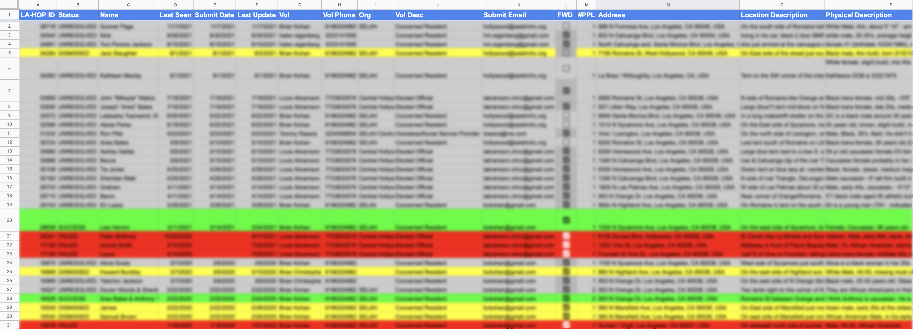

# [LA-HOP](https://www.lahsa.org/portal/apps/la-hop/) Tracker

***IF YOU WANT TO USE THIS TOOL PLEASE [FILL OUT THIS FORM](https://docs.google.com/forms/d/1a6rOii5MONQSlbHpghopkAFF-Wb70R29dj9kAUEMkt4) TO GET SUPPORT: ***

A [Google Apps Script](https://developers.google.com/apps-script) that monitors a gmail address for LA-HOP_ request messages and logs the status
of those HOPs to a Google spreadsheet. This script is in active use and works well, but it does
take some know-how to get setup and running. If you or your organization would like to use
this utility please [fill out this form.](https://docs.google.com/forms/d/1a6rOii5MONQSlbHpghopkAFF-Wb70R29dj9kAUEMkt4)
I will reach out and assist with any setup issues. Even if you don't require help setting it up, fill
out the form anyway to get notified of updates.

## Suggested Operation
If using this tracker as part of an organization where multiple people will be submitting HOPs, I
suggest devoting one gmail address to be the submitter email. All hops should be submitted using
that gmail address and this script will run only on that address. HOP submitters should then use their
own phone number when they submit the HOP. The email forwarding feature of this script lets users
map their phone number to their email address so any communications from LAHSA regarding that user's
HOPs will be automatically forwarded to them when this script runs.

## Setup

The steps to setup this script are broadly:

- Login to your gmail/google account.
- Navigate to https://script.google.com/
- Create a new project called LA HOP Tracker (or whatever)
- Copy and paste the contents of [trackHops.gs](https://github.com/bckohan/lahop-tracker/blob/main/trackHops.gs) into code.gs in the script editor
- Change this line: var HOP_SHEET_ID = ''; to var HOP_SHEET_ID = 'ID of your google spreadsheet';
    - The google sheet ID is the long string of random numbers and letters in the spreadsheet's url
- If you want to use the forwarding feature, create a sheet called "Forwards" of the following format in the
same google spreadsheet that logs the HOPs:

      |  1  | Phone      | Email                   |
      |-----|------------|-------------------------|
      |  2  | 5558183333 | myemail@example.com     |
      |  3  | 5553234444 | someoneelse@example.com |
      
- Run the script once manually. In the dropdown to the right of the `Debug` button, select `logHops` then hit the `Run` button. Google will prompt you to grant the script permissions. Grant them, it is safe.
- Set the script up to run daily, by navigating to "Triggers" (clock icon) and creating a new time based trigger. Select `logHops` as the function to run.

## Capturing old HOPs

This script can log individually forwarded HOPs. If you want to read in old HOPs you will have
to individually forward them to the address running this script OR run this script on the address(es)
holding the old HOPs OR run the [forwardHops.gs](https://github.com/bckohan/lahop-tracker/blob/main/forwardHops.gs) script on each address holding HOP messages to forward.
Unfortunately using gmail's bulk forward as attachment feature does not work
currently for some annoying technical reasons. There may be some add-ons available that provide a
bulk forwarding feature that works as intended, but I haven't tried them.

In gmail the best way to search for old HOPs is: `from: donotreply@lahsa.org subject: outreach request`

### [forwardHops.gs](https://github.com/bckohan/lahop-tracker/blob/main/forwardHops.gs)

This script finds every HOP sent where the current email address was the address of record on the HOP and does two things:

* tags the thread with the HOP label
* forwards each message in the thread to the configured address

To use this script, login to the email address holding the HOPs to forward and navigate to https://script.google.com/. Create a project called "Forward Hops" (or whaterver) and paste the [forwardHops.gs](https://github.com/bckohan/lahop-tracker/blob/main/forwardHops.gs) code into the editor. Edit the FORWARD_TO address at the top of the file and hit the run button. Only run this script once for each address.

## Formatting and Spreadsheet Customization

The script is robust to adding, rearranging or renaming columns. So feel free to do that. The script does no formatting itself, so apply whatever formatting you like.
